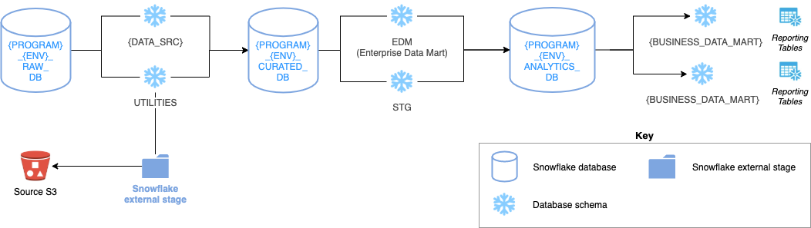

# Snowflake Lightweight Framework

Cookie-cutter framework to quickly create a lightweight Snowflake architecture.

---

## Contents

1. High-level summary
2. Getting started
    * Prerequisites
    * How-to run

---

## 1. High-level summary

The framework consists of using a `Makefile` to orchestrate the execution of `snowsql` commands.

Where the input args for the `Makefile` come from `env/env_example.json`.

---

## 2. Getting started

### Prerequisites

Before you begin, ensure you have met the following requirements:

| Mandatory / Optional | Prerequisite | Steps |
| -------| -----------| ------------------|
| Mandatory | Install [SnowSQL](https://docs.snowflake.com/en/user-guide/snowsql.html) and configure a SnowSQL [*named connection*](https://docs.snowflake.com/en/user-guide/snowsql-start.html#using-named-connections) | Once you've created a [*named connection*](https://docs.snowflake.com/en/user-guide/snowsql-start.html#using-named-connections), update the value of the corresponding key `SnowflakeNamedConn` within `env/env_example.json`. |
| Optional | Create a user for CI/CD activities | If you're looking to carry out CI/CD activities, you'll need to create a corresponding service role. The templated SQL script to create this user can be found within: `account_objects/user/v1_create_pipeline_deploy_user.sql` |

### How-to run

The steps involved in building and executing involve:

1) Updating the input parameters within `env/env_example.json`
2) and running `make`!
