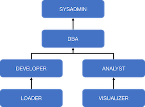

## Snowflake Lightweight Framework

Cookie-cutter framework to quickly create a lightweight Snowflake architecture.

### High-level summary

The framework consists of using a `makefile` to orchestrate the execution of `snowsql` commands. Where:

* the input `makefile` used is `example_build.mk`
* and the input args for the `makefile` come from `env/config_example.json`

The main execution steps are as follows:

1) Creates account objects needed to support the above architecture, including:
    * Databases for each of the zones highlighted above (raw, curated, analytics)
    * A custom role hierarchy (shown below), to exercise RBAC across all of the account/database objects created
    * Corresponding warehouses, resource monitors and 'custom admin-roles', to own account-level operations, e.g. to create a Snowflake Task, Storage Integration object etc.
2) Create database objects needed to support the above architecture.
(more to follow.)

### How-to run:

The steps involved in building and executing involve:

1) Updating the input parameters within `env/config_example.json`
2) and running `make`!
